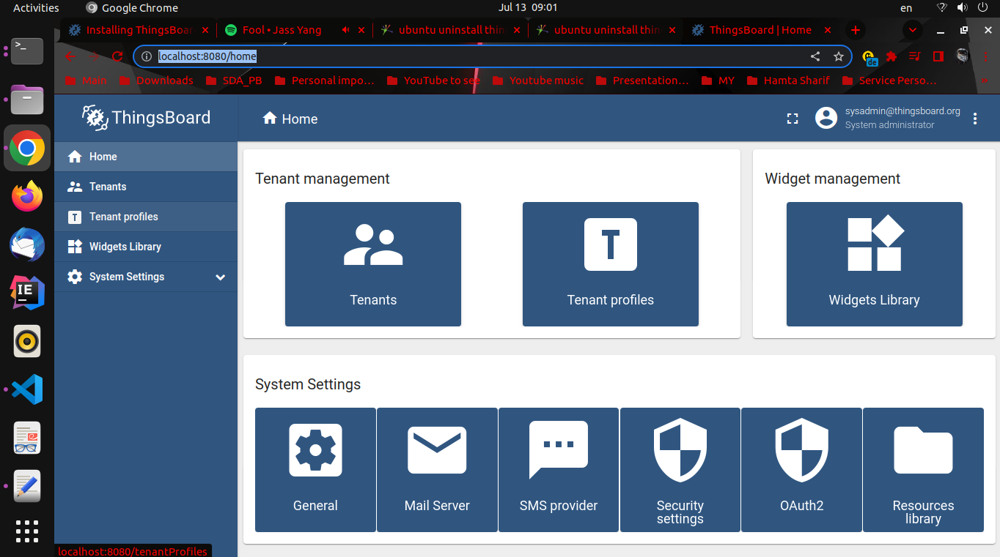
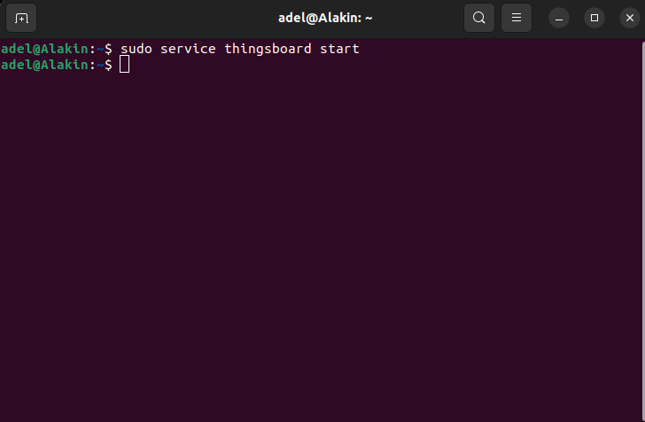
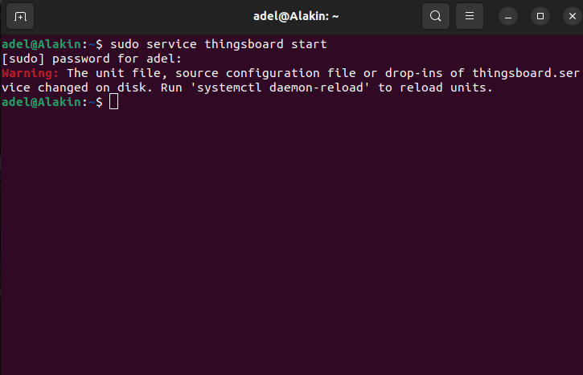

**_Author:_** Sayyed Adel Mirsharji --- Hamta Sharif 

**_Date And Time:_** Tuesday, 12 July 2022 --- سه شنبه ۱۴۰۱/۰۴/۲۱


# Introduction

Welcome to the **Hamta Sharif ThingsBoard API**! You can use our API to understannd what is **ThingsBoard** and how to use this open-source IoT platform in your IoT projects.

We have language bindings in shell script and YAML! You can view code examples in the dark area to the right, and you can switch the programming language of the examples with the tabs in the top right.

# Architecture

ThingsBoard is designed to be:

* **Scalabe**: horizontally scalable platform, build using leading open-source technologies.
* **Fault-tolerant**: no single-point-of-failure, every node in the cluster is identical.
* **Robust and efficient**: single server node can handle tens or even hundreds thousands of devices depending on         use-case. ThingsBoard cluster can handle millions of devices.
* **Durable**: never lose your data. ThingsBoard supports various queue implementations to provide extremely high message durability.
* **Customizable**: adding new functionality is easy with customizable widgets and rule engine nodes.

The diagram below shows key system components and interfaces thingsboard platform provide.


## ThingsBoard Transports
ThingsBoard provides multiple machine to machine network protocols such as: **MQTT**,**HTTP**,**CoAP** and **LwM2M**. Each of the protocol APIs are provided by a separate server component and is part of ThingsBoard “Transport Layer”. MQTT Transport also provides Gateway APIs to be used by gateways that represent multiple connected devices and/or sensors.

Once the Transport receives the message from device, it is parsed and pushed to durable Message Queue. The message delivery is acknowledged to device only after corresponding message is acknowledged by the message queue.

## ThingsBoard Core
ThingsBoard Core is responsible for handling **REST API** calls and WebSocket **subscriptions**. It is also responsible for storing up to date information about active device sessions and monitoring device connectivity state. ThingsBoard Core uses Actor System under the hood to implement actors for main entities: tenants and devices. Platform nodes can join the cluster, where each node is responsible for certain partitions of the incoming messages.

## ThingsBoard Rule Engine
ThingsBoard Rule Engine is the heart of the system and is responsible for processing incoming **messages**.
ThingsBoard Rule Engine may operate in two modes: **shared** and **isolated**. In shared mode, rule engine process messages that belong to multiple tenants. In isolated mode Rule Engine may be configured to process messages for specific tenant only.

## ThingsBoard Web UI
ThingsBoard provides a lightweight component written using Express.js framework to host static web ui content. Those components are **completely stateless** and no much configuration available. The static web UI contains application bundle. Once it is loaded, the application starts using the REST API and WebSockets API provided by ThingsBoard Core.

# ThingsBoard Deployment
ThingsBoard platform can be delpoyed in multiple ways:

* **On-premise** or **Cloud**
* **Standalone** or **Cluster mode**
* **Monolithic** or **Microservises**

## On-premise VS Cloud deployment
ThingsBoard supports both **on-premise** and **cloud deployments**. ThingsBoard can be runned in production on **AWS**, **Azure**, **GCE** and **private data centers**. It is possible to launch ThingsBoard in the **private network** with no internet access at all.

## Standalone VS Cluster mode
Platform is designed to be horizontally scalable and supports automatic discovery of new ThingsBoard servers (nodes). All ThingsBoard nodes inside cluster are **identical** and are sharing the load. Since all nodes are identical there is no **“master”** or **“coordinator”** processes and there is no single point of failure. The load balancer of your choice may forward request from devices, applications and users to all ThingsBoard nodes.

## Monolithic vs Microservices 
It is possible to run the ThingsBoard platform as a monolithic application or as a set of microservices. Monolithic mode needs less efforts, knowledge and hardware resources to do the setup and low maintenance efforts. However, if you do need high availability or would like to scale to millions of devices, then microservices is a way to go. 

# ThingsBoard Database
ThingsBoard uses database to store **entities** (devices, assets, customers, dashboards, etc) and **telemetry data**(attributes, timeseries sensor readings, statistics, events). Three database options can be used in ThingsBoard platform:

> To configure database for this platform we can do:


```yaml
  ts_max_intervals: "${DATABASE_TS_MAX_INTERVALS:700}" # Max number of DB queries generated by single API call to fetch telemetry records
  
  ts:
    type: "${DATABASE_TS_TYPE:sql}" # cassandra, sql, or timescale (for hybrid mode, DATABASE_TS_TYPE value should be cassandra, or timescale)
  
  ts_latest:
    type: "${DATABASE_TS_LATEST_TYPE:sql}" # cassandra, sql, or timescale (for hybrid mode, DATABASE_TS_TYPE value should be cassandra, or timescale)
```
* **SQL**: Stores all entities and telemetry in SQL database. ThingsBoard authors recommend to use PostgreSQL and this is the main SQL database that ThingsBoard supports. It is possible to use HSQLDB for local development purposes.
* **Hybrid (PostgreSQL + Cassandra)**: Stores all entities in PostgreSQL database and timeseries data in Cassandra database.
* **Hybrid (PostgreSQL + TimescaleDB)**: Stores all entities in PostgreSQL database and timeseries data in Timescale database.

# Programming languages and third-party
ThingsBoard back-end is written in **Java**, but we also have some micro-services based on **Node.js**. ThingsBoard front-end is a **SPA** based on **Angular 9** framework.

# Bulding from source
To build thingsboard platform from source first you should install **JAVA** and **Maven**, Thingsboard is bulid using JAVA 11 and Maven 3.1.0+.

### Step.1 Install Java 11 (OpenJDK)

>Run commands below in terminal in order to install Java 11

```shell
sudo apt update
sudo apt install openjdk-11-jdk
``` 
Finally you should see something like this:


After that you should configure operating system to use OpenJDK 11 by default.

>To configure operating system to use OpenJDK 11 by default use command below:

```shell
sudo update-alternatives --config java
```

Then you can check installation using the command in right panel.

>To check Java installation use command below:

```shell
java --version
```
<aside class="success">
If you see results like picture below everything is fine and java installed successfully!
</aside>


### Step.2 Install Maven 3.1.0+
To install Maven 3.1.0+ on Ubuntu run command in the right panel.

>To install Maven 3.1.0+ use command below:

```shell
sudo apt-get install maven
```


If everything goes fine you should see something like this:


Maven installation may set JAVA 7 set as **default JVM** on certain systems, To check your JVM version run commands in right panel.

>To check default JVM version your system using use command below:

```shell
sudo update-alternatives --config java
```

If your system default JVM is OpenJDK 11 you should see something like this:


### Step.3 Download Thingsboard Github repository
Use command in the right panel to download **Thingsboard source code**

>Downloading Thingsboard repo and checking out to newest version:

```shell
git clone git@github.com:thingsboard/thingsboard.git
# checkout latest release branch
cd thingsboard/
git checkout release-3.3
```

<aside class="notice">
To checkout you should go to thingsboard folder you cloned!
</aside>

The result of running commands in the right panel would be like:


### Step.4 Bulding 
To build thingsboard project you can either use **Maven** in **Terminal** or do building process using **IntelliJ IDE**.

<aside class="warning">
If you are using ((Iran IP location)), in bulding process you will get ((connection timeout error)) in ((Thingsboard HTTP Transport Common)) section. To solve this problem you should change your ip. (You can use instructions below to use Tor proxy to solve this problem)
</aside>

### Step.4.1 Instructions to change your ip (using Tor)
The error you will see becuase of using iran ip location:


First you should install Tor on your system.(Use commands on the right pannel)

```shell
sudo apt-get update
sudo apt-get upgrade
sudo apt install tor
```

**we use kalitorify**:

kalitorify is a shell script which use iptables settings to create a Transparent Proxy through the Tor Network, the program also allows you to perform various checks like checking the Tor Exit Node (i.e. your public IP address when you are under Tor proxy), or if Tor has been configured correctly checking service and network settings.

kalitorify github:
https://github.com/brainfucksec/kalitorify

So use commands in right panel to clone kalitorify repository from github:

>Cloning kalitorify

```shell
git clone https://github.com/brainfucksec/kalitorify.git
#go to cloned repo file
cd kalitorigy
#in ../kalitorify directory
sudo make install 
#restart your system
reboot
``` 

Kalitorify commands list:

* start transparent proxy through tor : **sudo kalitorify -t**  
* check status of program and services: **sudo kalitorify -s**
* restart tor service and change IP address: **sudo kalitorify --restart**
* reset iptables and return to clearnet navigation: **sudo kalitorify -c**

>Running transaprent proxy through tor: 

```shell
sudo kalitorify -t
#to check your status
sudo kalitorify -s
```

Now your ip problem should be solved and you should not get stuck at **Thingsboard HTTP Transport Common** build process.

<aside class="warning">
By the time this API doc is being built latest version of ThingsBoard is release-3.3, in this version bulding Thingsboard Server UI will fail cause of wrong github urls in two files: 1-../ui-ngx/package.json  2-../ui-ngx/yarn.lock. Use intructions below to solve this problem.
</aside>

### Step.4.2 Instructions to fix wrong github urls to build Thingsboard Server UI successfully
The error you will face if these wrong github urls remain:


To solve this problem you can download files from this github repository: **https://github.com/thingsboard/thingsboard/pull/6298/commits/697965**
**d3cac70b3905545a6a55a62fecf7c53200**


>Sloving Server UI error

```shell 
#in package.json
#swap these lines whit lines below them:
line-49   "flot": "git://github.com/thingsboard/flot.git#0.9-work",
line-50   "flot.curvedlines": "git://github.com/MichaelZinsmaier/CurvedLines.git#master",
line-72   "ngx-flowchart": "git://github.com/thingsboard/ngx-flowchart.git#release/1.0.0",

new-line-49   "flot": "https://github.com/thingsboard/flot.git#0.9-work",
new-line-50   "flot.curvedlines": "https://github.com/MichaelZinsmaier/CurvedLines.git#master",
new-line-72   "ngx-flowchart": "https://github.com/thingsboard/ngx-flowchart.git#release/1.0.0",

#in yarn.lock
#swap these lines whit lines below them:
line-4544  "flot.curvedlines@git://github.com/MichaelZinsmaier/CurvedLines.git#master":
line-4546   resolved "git://github.com/MichaelZinsmaier/CurvedLines.git#22ed1fc2a6ccafc816c2d07b36027cc123825c4b"
line-4548   "flot@git://github.com/thingsboard/flot.git#0.9-work":
line-4550   resolved "git://github.com/thingsboard/flot.git#0ff0c775db7c74e705f6c3c2bba92080a202ccd4"
line-6640   "ngx-flowchart@git://github.com/thingsboard/ngx-flowchart.git#release/1.0.0":
line-6642   resolved "git://github.com/thingsboard/ngx-flowchart.git#aac96f7e0490a386d58864d7819873e7c63cbb48"

new-line-4544  "flot.curvedlines@https://github.com/MichaelZinsmaier/CurvedLines.git#master":
new-line-4546   resolved "https://github.com/MichaelZinsmaier/CurvedLines.git#22ed1fc2a6ccafc816c2d07b36027cc123825c4b"
new-line-4548   "flot@https://github.com/thingsboard/flot.git#0.9-work":
new-line-4550   resolved "https://github.com/thingsboard/flot.git#0ff0c775db7c74e705f6c3c2bba92080a202ccd4"
new-line-6640   "ngx-flowchart@https://github.com/thingsboard/ngx-flowchart.git#release/1.0.0":
new-line-6642   resolved "https://github.com/thingsboard/ngx-flowchart.git#aac96f7e0490a386d58864d7819873e7c63cbb48"

```

or you can manually change these lines in these two files:

1-package.json:

**Change these lines whit lines under them**

**Old lines:**

**Line-49:** "flot": "git://github.com/thingsboard/flot.git#0.9-work",

**Line-50:** "flot.curvedlines": "git://github.com/MichaelZinsmaier/CurvedLines.git#master",

**Line-72:** "ngx-flowchart": "git://github.com/thingsboard/ngx-flowchart.git#release/1.0.0",

**New lines(to replace):**

**New-Line-49:** "flot": "https://github.com/thingsboard/flot.git#0.9-work",

**New-Line-50:** "flot.curvedlines": "https://github.com/MichaelZinsmaier/CurvedLines.git#master",

**New-Line-72:** "ngx-flowchart": "https://github.com/thingsboard/ngx-flowchart.git#release/1.0.0",

2-yarn.lock:

**Old lines:**

**Line-4544:**  "flot.curvedlines@git://github.com/MichaelZinsmaier/CurvedLines.git#master":

**Line-4546**   resolved "git://github.com/MichaelZinsmaier/CurvedLines.git#22ed1fc2a6ccafc816c2d07b36027cc123825c4b"

**Line-4548**   "flot@git://github.com/thingsboard/flot.git#0.9-work":

**Line-4550**   resolved "git://github.com/thingsboard/flot.git#0ff0c775db7c74e705f6c3c2bba92080a202ccd4"

**Line-6640**   "ngx-flowchart@git://github.com/thingsboard/ngx-flowchart.git#release/1.0.0":

**Line-6642**   resolved "git://github.com/thingsboard/ngx-flowchart.git#aac96f7e0490a386d58864d7819873e7c63cbb48"

**New lines(to replace):**

**New-Line-4544:**  "flot.curvedlines@https://github.com/MichaelZinsmaier/CurvedLines.git#master":

**New-Line-4546**   resolved "https://github.com/MichaelZinsmaier/CurvedLines.git#22ed1fc2a6ccafc816c2d07b36027cc123825c4b"

**New-Line-4548**   "flot@https://github.com/thingsboard/flot.git#0.9-work":

**New-Line-4550**   resolved "https://github.com/thingsboard/flot.git#0ff0c775db7c74e705f6c3c2bba92080a202ccd4"

**New-Line-6640**   "ngx-flowchart@https://github.com/thingsboard/ngx-flowchart.git#release/1.0.0":

**New-Line-6642**   resolved "https://github.com/thingsboard/ngx-flowchart.git#aac96f7e0490a386d58864d7819873e7c63cbb48"

Now you can start bulding process and you should not face any failure!

### Step.4.3 Start Building Process Using Terminal
Use shell script command in right panel to start building ThingsBoard.

<aside class="notice">
Run command in the right panel in terminal in the thingsboard repository you just downloaded
</aside>

>Maven terminal command to build thingsboard

```shell
mvn clean install -DskipTests
```


**If you follow two instrucions at top to solve iran ip and wrong git urls problems your result should be like:**


### Step.4.3 Start Building Process Using Intellij IDE
<aside class="notice">To build thingsboard source code using Intellij IDE you should do changing ip and fixing wrong git urls (intructions are at top of this section) before this.
</aside>

to start building it using intellij go to file-->Settings-->Build, Execution, Deployment-->Maven-->runner, here check the box **Deligate IDE build/run actions to Maven** and click apply and then ok.


then click on green hammer to start bulding project whit Maven:


<aside class="notice">Build artifacts will be in thingsboard/application/target directory in Thingsboard folder.</aside>

Building Process Took **45min** to compelete on **Lenovo ThinkPad X230**:

* **Thinkspad X230 Hardware**:

* Memory: 8GB
* Processor: Intel® Core™ i5-3230M CPU @ 2.60GHz × 4
* 320GB Hard Disk


# Installing Thingsboard 

### Step.1 Installing thingsboard from debian file
To install thingsboard from your build output debian file go to **thingsboard/application/target**.

>Command to install thingsboard from thingsboard.deb file

```shell
sudo dpkg -i thingsboard.deb
```

If your build from source code was successfull you should see a **thingsboard.deb** file in this directory.

To start installing thingsboard on your system run shell scripit command in the right pannel.

### Step.2 Creating Thingsboard Database
In this API doc we use **PostgreSQL** Database.

Use shell script command in the right panel to install PostgreSQL database.

>PostgreSQL Installation

```shell
# install **wget** if not already installed:
sudo apt install -y wget

# import the repository signing key:
wget --quiet -O - https://www.postgresql.org/media/keys/ACCC4CF8.asc | sudo apt-key add -

# add repository contents to your system:
RELEASE=$(lsb_release -cs)
echo "deb http://apt.postgresql.org/pub/repos/apt/ ${RELEASE}"-pgdg main | sudo tee  /etc/apt/sources.list.d/pgdg.list

# install and launch the postgresql service:
sudo apt update
sudo apt -y install postgresql-12
sudo service postgresql start
```

Once PostgreSQL is installed you may want to create a new user or set the password for the the main user. The instructions on the right panel will help to set the password for main postgresql user.

>PostgresSQL database configuration

```shell
sudo su - postgres
psql
\password
\q
```

Then, press “Ctrl+D” to return to main user console and use commands in the right panl connect to the database to create thingsboard DB.

>Create thingsboard DB:

```shell
psql -U postgres -d postgres -h 127.0.0.1 -W
CREATE DATABASE thingsboard;
\q
```

### Step.3 Thingsboard Database Configuration

Use shell scripit command in the right panel to edit **thingsboard.conf** using **NANO editor**.

>Edit thingsboard.conf

```shell 
sudo nano /etc/thingsboard/conf/thingsboard.conf
```

* Now add the lines in the right panel to configuration file:

>Lines to add to thingsboard configuration file

```shell
# DB Configuration 
export DATABASE_TS_TYPE=sql
export SPRING_JPA_DATABASE_PLATFORM=org.hibernate.dialect.PostgreSQLDialect
export SPRING_DRIVER_CLASS_NAME=org.postgresql.Driver
export SPRING_DATASOURCE_URL=jdbc:postgresql://localhost:5432/thingsboard
export SPRING_DATASOURCE_USERNAME=postgres
export SPRING_DATASOURCE_PASSWORD=PUT_YOUR_POSTGRESQL_PASSWORD_HERE
# Specify partitioning size for timestamp key-value storage. Allowed values: DAYS, MONTHS, YEARS, INDEFINITE.
export SQL_POSTGRES_TS_KV_PARTITIONING=MONTHS
```

<aside class="notice"> Dont forget to change PUT_YOUR_POSTGRESQL_PASSWORD_HERE to your actual postgres user passwrd </aside>

### Step.4 Choose ThingsBoard queue service
In this API doc we chose **In-memory** queue implementation.

**_NOTE:_**  In Memory queue is built-in and enabled by default. No additional configuration steps required.

### Step.5 Run installation script
Once ThingsBoard service is installed and DB configuration is updated, you can execute the shell script in the right pannel.

>Command to use --loadDemo option to load demo data

```shell
# --loadDemo option will load demo data: users, devices, assets, rules, widgets.
sudo /usr/share/thingsboard/bin/install/install.sh --loadDemo
```

### Step.6 Starting Thingsboard service
Execute the command in the right panel to start ThingsBoard.

>Thingsboard service start

```shell
sudo service thingsboard start
```

Once started, you will be able to open Web UI using the following link:

* **http://localhost:8080/**

The following default credentials are available if you have specified –loadDemo during execution of the installation script:

* System Administrator: sysadmin@thingsboard.org / sysadmin
* Tenant Administrator: tenant@thingsboard.org / tenant
* Customer User: customer@thingsboard.org / customer


Finally if you follow all steps correctly you should see thingsboard server ui:

 
# Uninstalling Thingsboard 

* To **check if thingsboard is installed** on your system follow instructions below.

1-First start thingsboard service.

2-Now you can connect to http://localhost:8080/ .




>Shell commands to fully delete thingsboard from your system

```shell
#command to list thingsboard
sudo dpkg -l | grep thingsboard 

#commands to remove thingsboard
sudo dpkg -r thingsboard
sudo dpkg --purge thingsboard

#you can delete thingsboard logs using command below
cd /var/log
sudo rm -rf thingsboard

#commands to check if thingsboard is uninstalled
sudo dpkg -l | grep thingsboard 
sudo dpkg -p thingsboard
```

* To **uninstall thinsboard** from your system use shell script commands in right pannel.

Now if you use thingsboard serivce command the result would be:


